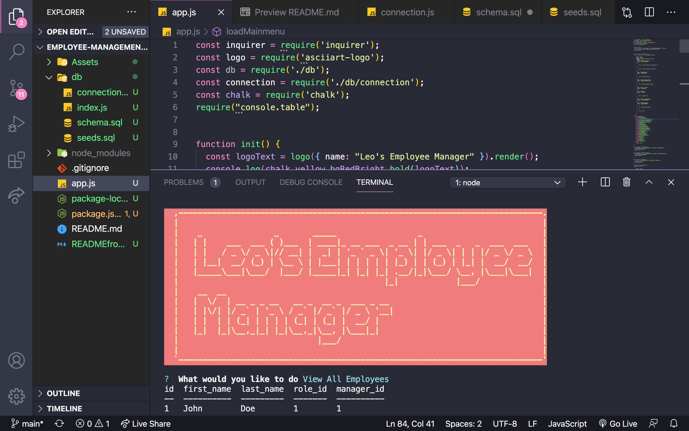

 # Employee Management System
  
  ## Table of Contents
  * [Description](#description)
  * [Installation](#installation)
  * [Usage](#usage)
  * [Contributors](#contributors)
  * [License](#license)
  * [Test](#test)
  * [Questions](#questions)
  * [DEMO](#demo)
  ## Description
  Using npm inquirer, local database, inquirer and chalk, I created a simple app to manage employees datas.
  
  ## Installation 
  git clone from github, npm init -y and npm i
  
  ## Usage 
  NONE
  
  ## Contributors rules
  NONE
  
  ## License
  MIT
  
  ## Test
  node app.js
  
  ## Questions
  Contact me:
  
  Github:[leolee2708](https://github.com/leolee2708)
  
  Email:[leho.vietquan@gmail.com](https://github.com/leolee2708)
  
  ## DEMO

https://www.loom.com/share/237a52d7b71744c8a53359f376849704